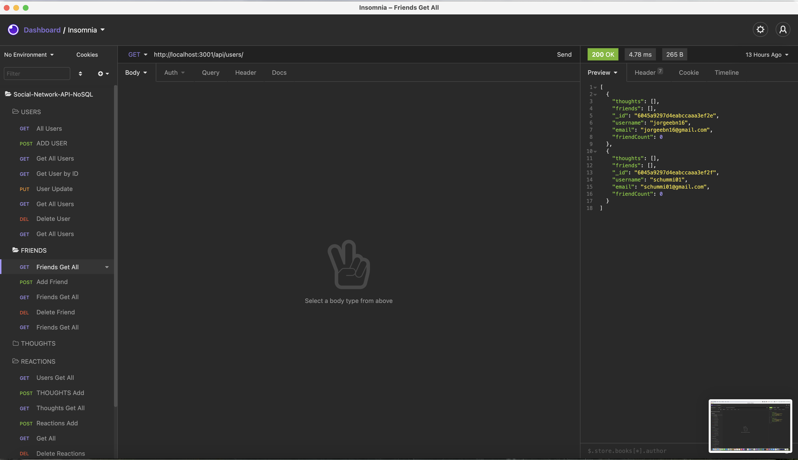
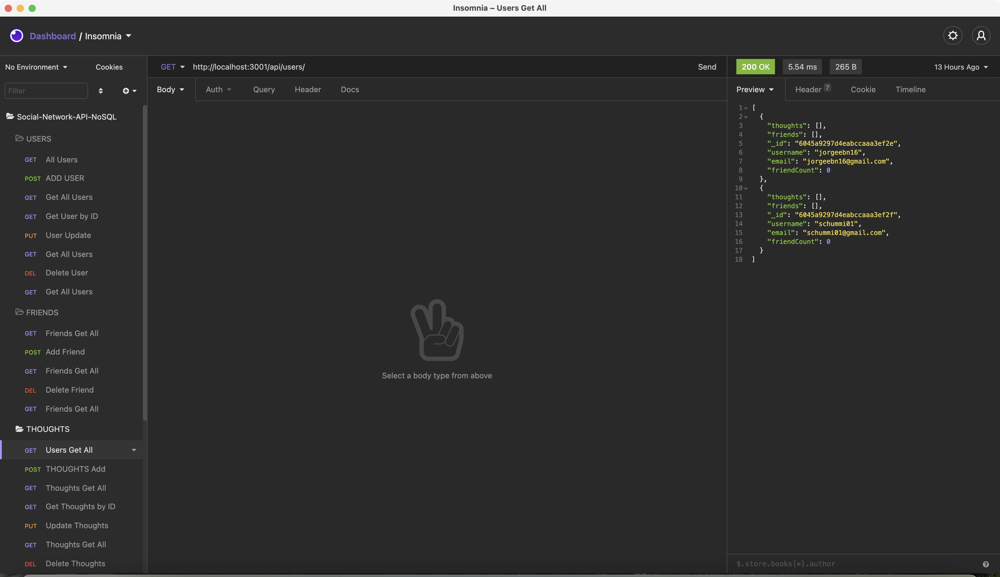

# 18-NoSQL-Challenge-Social-Network-API
Social-Network-API

## Table of Contents

* [Description](#Description)
* [Requirements](#Requirements)
* [Installation](#Installation)
* [Usage](#Usage)
* [License](#License)
* [Badges](#Badges)
* [Issues](#Issues)
* [Technologies](#Technologies)
* [Screenshot](#screenshot)
* [Walkthrough-Video](#walkthrough-video)
* [Deployment](#deployment)
* [Contributing](#Contributing)
</br>
</br>

## Description
An API for a social network web application where users can share their thoughts, react to friends’ thoughts, and create a friend list. This project uses Express.js for routing, a MongoDB database, the Mongoose ODM and Moment for Date string manipulation.
<br>
<br>

## Requirements

#### User Story
>AS A social media startup, I WANT an API for my social network that uses a NoSQL database. SO THAT my website can handle large amounts of unstructured data
<br>

>GIVEN a social network API
<br>

>WHEN I enter the command to invoke the application<br>
>>THEN my server is started and the Mongoose models are synced to the MongoDB database<br>

>WHEN I open API GET routes in Insomnia Core for users and thoughts<br>
>>THEN the data for each of these routes is displayed in a formatted JSON<br>

>WHEN I test API POST, PUT, and DELETE routes in Insomnia Core<br>
>>THEN I am able to successfully create, update, and delete users and thoughts in my database<br>

>WHEN I test API POST and DELETE routes in Insomnia Core<br>
>>THEN I am able to successfully create and delete reactions to thoughts and add and remove friends to a user’s friend list<br>

<br>
<br>

## Installation
To use this application, please install: 
```
npm install
```

<br/>
<br/>

## Usage
In order to use the application, run the following commands:
```
npm run seed
npm start
```

<br/>
<br/>

## License 
[](https://opensource.org/licenses/MIT)
</br>
</br>

## Badges


</br>
</br>

## Issues
[](https://GitHub.com/jorgeebn16/18-NoSQL-Challenge-Social-Network-API/issues/)
[](https://GitHub.com/jorgeebn16/18-NoSQL-Challenge-Social-Network-API/issues?q=is%3Aissue+is%3Aclosed)
</br>
</br>

## Technologies
* [Javascript](https://developer.mozilla.org/en-US/docs/Web/JavaScript)
* [npm](https://www.npmjs.com/)
* [mongoose](https://mongoosejs.com/)
* [momentjs](https://momentjs.com/)
* [mongoose-seed](https://www.npmjs.com/package/mongoose-seed)
<br/>
<br/>

## Screenshot





</br>
</br>

## Walkthrough Video
View the [DB Start and User Routes.](https://drive.google.com/file/d/1GZGeiMymgcnQ9_LSX2oFyzA9HphQZ0tj/view)</br>
View the [Friends Routes.](https://drive.google.com/file/d/1tRIx6ybq25Rt2xPpy2GT5Rfp8U_XshER/view)</br>
View the [Thought Routes.](https://drive.google.com/file/d/1Tw6MwPwoIjI98QMfGwmIw-J024jdPkSD/view)</br>
View the [Reactions Routes.](https://drive.google.com/file/d/1-IrG7p4nm-djT4fumiZbW7q4hJtHhoHW/view)</br>
</br>
</br>

## Deployment
View [Github repository URL](https://github.com/jorgeebn16/18-NoSQL-Challenge-Social-Network-API)

## Contributing
[](https://GitHub.com/Naereen/jorgeebn16/18-NoSQL-Challenge-Social-Network-API/graphs/contributors/)

For anyone who wishes to contribute you can contact me with at jorgeebn16@gmail.com
</br>
</br>

Would you like to reach me?
</br>
Contact Me:

Github: https://github.com/jorgeebn16</br>
Email: jorgeebn16@gmail.com


## Issues
[](https://GitHub.com/jorgeebn16/18-NoSQL-Challenge-Social-Network-API/issues/)
[](https://GitHub.com/jorgeebn16/18-NoSQL-Challenge-Social-Network-API/issues?q=is%3Aissue+is%3Aclosed)


